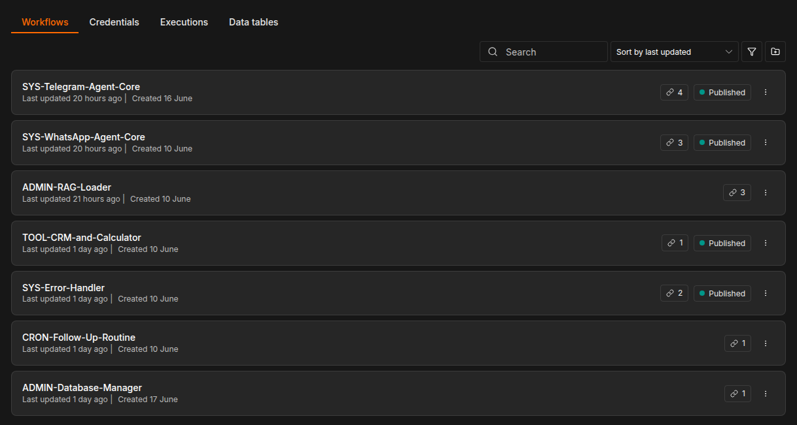
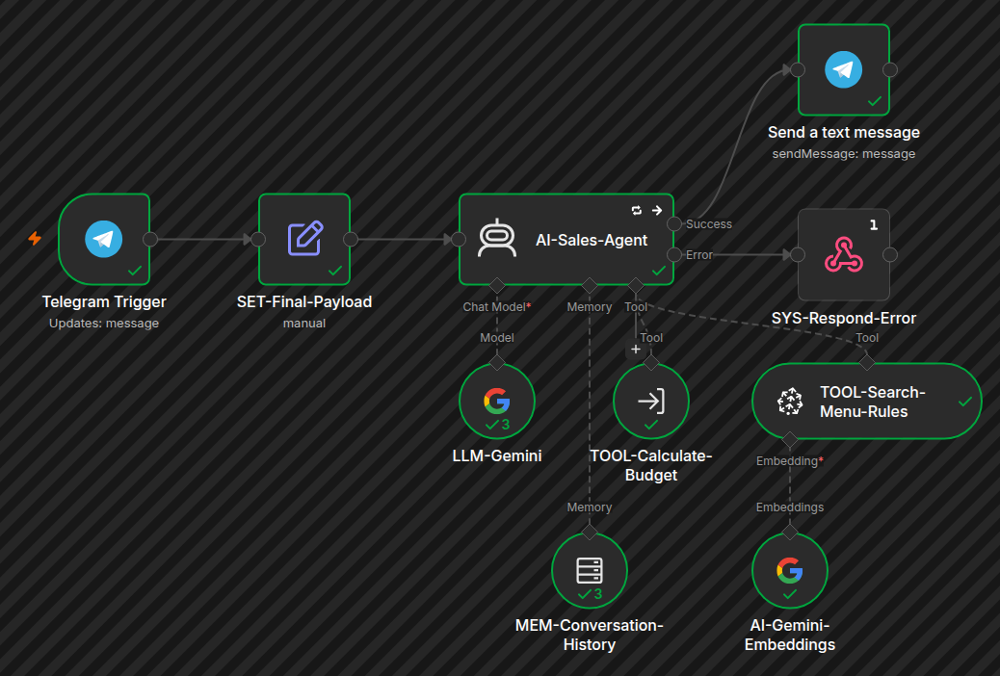
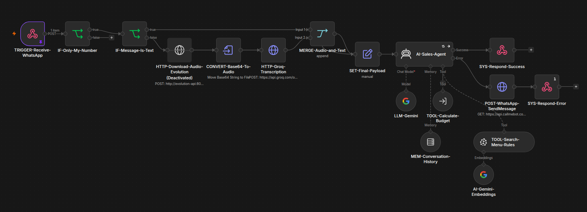
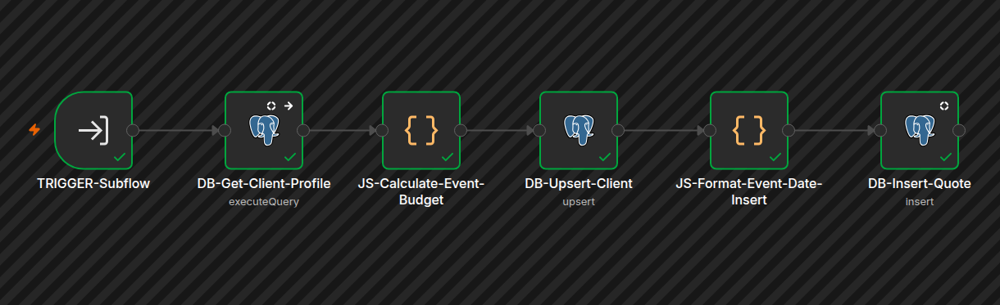
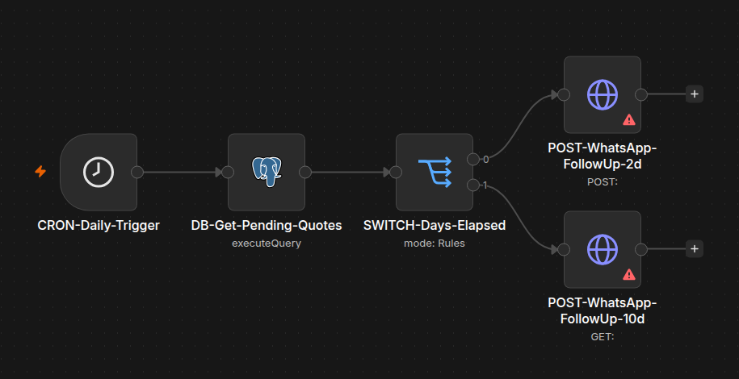
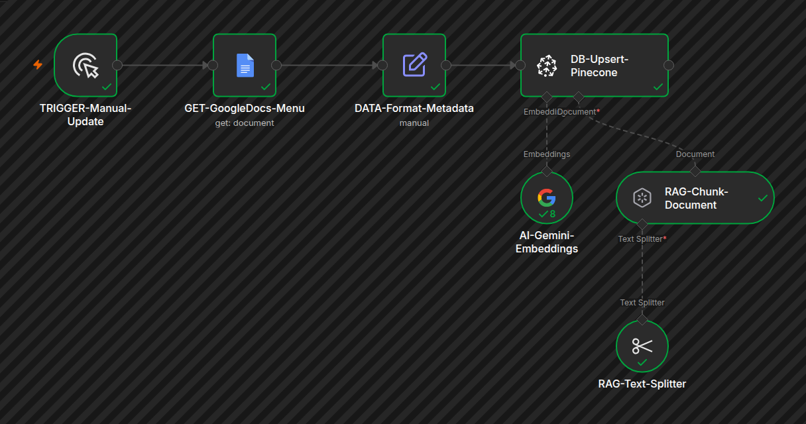
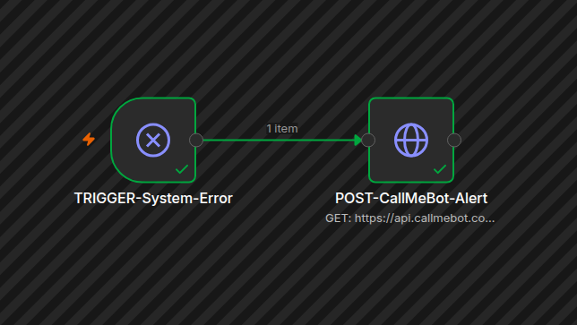

# 🤖 AI Sales Agent & CRM Orchestrator / Agente de Vendas com IA & Orquestrador CRM

Welcome to the repository of the Intelligent Sales Automation Platform. This project resolves operational bottlenecks in customer acquisition and immediate event quoting by introducing a highly decoupled, stateful, and context-aware AI agent system.

---

### 🌐 Select Language / Selecione o Idioma

* [🇬🇧 English Version](#-english-version)
* [🇧🇷 Versão em Português](#-versão-em-português)

---

## 🇬🇧 English Version

### 📌 Project Overview & Business Value
In high-intent customer service environments (such as event and party venues), response delay directly correlates with a drop in conversion rates. This project replaces manual or brittle rule-based auto-replies with an advanced, event-driven AI Sales Agent.

The system handles non-linear customer conversations, extracts essential event metrics, interfaces with a relational database for CRM management, calculates precise dynamic quotes via a mathematical script engine, and drives conversions through automated re-engagement funnels.

### 📂 Repository Directory Structure
The repository is structured logically to separate the orchestration layer, database schemas, prompt engineering assets, and DevOps scripts:

├── codes/ 
│&nbsp;&nbsp;&nbsp;├── [JS-Calculate-Event-Budget.js](codes/JS-Calculate-Event-Budget.js) 
│&nbsp;&nbsp;&nbsp;└── [JS-Format-Event-Date-Insert.js](codes/JS-Format-Event-Date-Insert.js) 
├── infrastructure/ (OCI) 
│&nbsp;&nbsp;&nbsp;├── [.env.example](infrastructure/.env.example) 
│&nbsp;&nbsp;&nbsp;├── [docker-compose.yml](infrastructure/docker-compose.yml) 
│&nbsp;&nbsp;&nbsp;└── [update_tunnel.sh](infrastructure/update_tunnel.sh) 
├── prompts/ 
│&nbsp;&nbsp;&nbsp;├── [AI-Sales-Agent.txt](prompts/AI-Sales-Agent.txt) 
│&nbsp;&nbsp;&nbsp;└── [TOOL-Calculate-Budget.txt](prompts/TOOL-Calculate-Budget.txt) 
├── queries/ 
│&nbsp;&nbsp;&nbsp;├── [DB-Build-Tables.sql](queries/DB-Build-Tables.sql) 
│&nbsp;&nbsp;&nbsp;├── [DB-Get-Client-Profile.sql](queries/DB-Get-Client-Profile.sql) 
│&nbsp;&nbsp;&nbsp;└── [DB-Get-Pending-Quotes.sql](queries/DB-Get-Pending-Quotes.sql) 
├── workflows/ 
│&nbsp;&nbsp;&nbsp;├── [ADMIN-Database-Manager.json](workflows/ADMIN-Database-Manager.json) 
│&nbsp;&nbsp;&nbsp;├── [ADMIN-RAG-Loader.json](workflows/ADMIN-RAG-Loader.json) 
│&nbsp;&nbsp;&nbsp;├── [CRON-Follow-Up-Routine.json](workflows/CRON-Follow-Up-Routine.json) 
│&nbsp;&nbsp;&nbsp;├── [SYS-Error-Handler.json](workflows/SYS-Error-Handler.json) 
│&nbsp;&nbsp;&nbsp;├── [SYS-Telegram-Agent-Core.json](workflows/SYS-Telegram-Agent-Core.json) 
│&nbsp;&nbsp;&nbsp;├── [SYS-WhatsApp-Agent-Core.json](workflows/SYS-WhatsApp-Agent-Core.json) 
│&nbsp;&nbsp;&nbsp;└── [TOOL-CRM-and-Calculator.json](workflows/TOOL-CRM-and-Calculator.json) 
├── workflows-screenshots/ 
│&nbsp;&nbsp;&nbsp;└── [Visual Architecture Maps](#-visual-workflow-architecture) 
├── .gitignore 
├── README.md 
└── troubleshooting-log.txt

### 🔌 Tech Stack & Cloud Infrastructure
The application is deployed in a production-ready, containerized cloud environment:
* **Orchestration & Logic:** n8n
* **AI & LLMs:** Google Gemini API for core reasoning and embeddings.
* **Audio Processing:** Groq (Whisper-large-v3) for voice message transcription (WhatsApp flow).
* **Vector Engine (RAG):** Pinecone, serving as the context store for document and menu retrieval.
* **Relational Database:** PostgreSQL for transactional logging, user profiling, and long-term quote tracking (CRM).
* **Messaging Integrations:** Evolution API (WhatsApp), Telegram API, and CallMeBot.
* **Infrastructure:** Ubuntu Linux, Docker, Docker Compose, and Cloudflare Tunnels.

### 🛠 Engineering Case Studies & Troubleshooting

#### 1. Resilience and Technical Pivot (Evolution API to Telegram)
During development, the system faced a critical integration challenge with WhatsApp.
* **The Problem:** The latest versions of the Evolution API enforce strict infrastructure requirements (Redis for caching and PostgreSQL for state management) to comply with Meta's standards. Attempting to bypass these requirements by using an older API version resulted in connection instability. Subsequent rapid reconnection attempts triggered Meta's anti-spam filters, leading to a temporary shadowban on the testing number.
* **The Solution:** Because the system was built with a highly decoupled architecture, the "AI Brain" (n8n + Gemini) was completely isolated from the "Messaging Layer". I seamlessly pivoted the primary production trigger to **Telegram** while the WhatsApp number warmed up. This proved that the core logic is channel-agnostic and resilient to third-party API outages.

#### 2. Dynamic Routing & DevOps Automation (Cloudflare Tunnels)
* **The Problem:** To expose the local development server to the internet without modifying DNS records, I utilized temporary Cloudflare tunnels (`trycloudflare.com`). However, the public URL changed every time the tunnel restarted, which broke the Google Docs API OAuth callbacks used for the RAG pipeline.
* **The Solution:** I engineered a custom Linux shell script orchestrated via `crontab`. Every 12 hours, the script automatically detects tunnel URL changes, injects the new URL into the n8n `.env` file (`WEBHOOK_URL`), and gracefully restarts the Docker containers, maintaining system connectivity autonomously.

### ⚙️ Decoupled Workflow & Sub-flow Architecture
To prevent workflow bloating and enforce the Single Responsibility Principle, the automation layer is split into specialized micro-processes:

1. **SYS-Telegram-Agent-Core (Production) & SYS-WhatsApp-Agent-Core (Warm-up)**
   * **Dual Triggers:** Independent workflows handling Telegram webhooks and WhatsApp incoming messages.
   * **Audio Handling (WhatsApp Only):** Intercepts voice notes, downloads base64 from Evolution API, and routes them to Groq/Whisper for instant transcription before hitting the LLM.
   * **Core Engine:** Passes the payload into an Advanced AI Agent Node bound to the Google Gemini API with full conversation memory.
   * **Tooling:** The agent has native access to a `Calculate-Budget` tool connected directly to the Calculation sub-flow.

2. **TOOL-CRM-and-Calculator: Calculation & CRM Engine**
   * **Data Enrichment:** Performs an optimized PostgreSQL `LEFT JOIN` query to fetch historical profiles, identifying returning clients instantaneously.
   * **Deterministic Execution:** Processes the payload through an isolated JavaScript code node to compute strict event calculations (pricing bands segmented by adult count, child groups aged 4-6, and child groups aged 7-11).
   * **Persistence Layer:** Performs an atomic `upsert` on the `clients` table and appends a structured log into `event_quotes`.

3. **CRON-Follow-Up-Routine: Active Conversion Follow-Up**
   * **Trigger:** Instantiated daily via an automated time trigger.
   * **Pipeline Evaluation:** Scans the database for open leads where a quote was sent exactly 2 days or 10 days ago.
   * **Conditional Routing:** Leverages an n8n Switch node to dispatch highly targeted re-engagement messages.

4. **ADMIN-RAG-Loader: Administrative Data Pipeline**
   * **Execution:** Run manually upon package or menu changes.
   * **ETL Pipeline:** Connects to an official Google Document, tokenizes the unstructured catalog text, generates vector embeddings via Gemini API, and updates the index inside Pinecone.

5. **SYS-Error-Handler: Global Error Management**
   * **Trigger:** Listens globally across all nodes via error triggers.
   * **Notification:** Immediately fires an outbound HTTP request to CallMeBot, routing critical stack traces directly to the developer's personal phone.

### 📸 Visual Workflow Architecture

**Global Architecture Overview**

**1. Reactive Agent & Core Routing**

**2. Calculator & CRM Engine**

**3. Active Conversion Follow-Up**

**4. Administrative RAG Feed Pipeline**

**5. Database Manager**

**6. Global Error Management**

### 🧠 Advanced AI Engineering Concepts
* **ReAct Framework (Reasoning and Acting):** The system prompt restricts the LLM from making assumptions. It forces the model to follow a strict logical loop: *Observe* the user data ➔ *Think* about what variables are missing ➔ *Act* by either querying the vector index, requesting targeted information, or invoking the calculation engine.
* **Context Injection & Grounding (RAG):** Business rules, menu database, and FAQs are fetched from the vector store and dynamically appended to the context windows, ensuring zero hallucination.
* **Schema Enforcement:** Strict prompt engineering ensures the AI parses natural language into precise JSON schemas required by the database.

### 🔮 Future Roadmap
* **DNS & SSL Implementation:** Map the application to a custom domain via Cloudflare Zero Trust to permanently resolve OAuth dynamic redirect issues.
* **CI/CD Pipeline:** Implement GitHub Actions for automated deployment and environment synchronization.

---

## 🇧🇷 Versão em Português

### 📌 Visão Geral do Projeto e Valor de Negócio
Em ambientes de atendimento ao cliente com alta intenção de compra (como o setor de festas e eventos), a demora na resposta impacta diretamente a taxa de conversão. Este projeto substitui respostas automáticas estáticas e limitadas por um Agente de Vendas com IA avançado e autônomo.

O sistema gerencia conversas não-lineares, extrai métricas essenciais do evento, faz interface com um banco de dados relacional (CRM), calcula orçamentos complexos por meio de scripts determinísticos e impulsiona as vendas através de funis automatizados de reengajamento.

### 📂 Estrutura de Pastas do Repositório
O repositório foi estruturado de forma lógica para separar a camada de orquestração, os schemas de banco de dados, os ativos de engenharia de prompt e os scripts:

├── codes/ 
│&nbsp;&nbsp;&nbsp;├── [JS-Calculate-Event-Budget.js](codes/JS-Calculate-Event-Budget.js) 
│&nbsp;&nbsp;&nbsp;└── [JS-Format-Event-Date-Insert.js](codes/JS-Format-Event-Date-Insert.js) 
├── infrastructure/ 
│&nbsp;&nbsp;&nbsp;├── [.env.example](infrastructure/.env.example) 
│&nbsp;&nbsp;&nbsp;├── [docker-compose.yml](infrastructure/docker-compose.yml) 
│&nbsp;&nbsp;&nbsp;└── [update_tunnel.sh](infrastructure/update_tunnel.sh) 
├── prompts/ 
│&nbsp;&nbsp;&nbsp;├── [AI-Sales-Agent.txt](prompts/AI-Sales-Agent.txt) 
│&nbsp;&nbsp;&nbsp;└── [TOOL-Calculate-Budget.txt](prompts/TOOL-Calculate-Budget.txt) 
├── queries/ 
│&nbsp;&nbsp;&nbsp;├── [DB-Build-Tables.sql](queries/DB-Build-Tables.sql) 
│&nbsp;&nbsp;&nbsp;├── [DB-Get-Client-Profile.sql](queries/DB-Get-Client-Profile.sql) 
│&nbsp;&nbsp;&nbsp;└── [DB-Get-Pending-Quotes.sql](queries/DB-Get-Pending-Quotes.sql) 
├── workflows/ 
│&nbsp;&nbsp;&nbsp;├── [ADMIN-Database-Manager.json](workflows/ADMIN-Database-Manager.json) 
│&nbsp;&nbsp;&nbsp;├── [ADMIN-RAG-Loader.json](workflows/ADMIN-RAG-Loader.json) 
│&nbsp;&nbsp;&nbsp;├── [CRON-Follow-Up-Routine.json](workflows/CRON-Follow-Up-Routine.json) 
│&nbsp;&nbsp;&nbsp;├── [SYS-Error-Handler.json](workflows/SYS-Error-Handler.json) 
│&nbsp;&nbsp;&nbsp;├── [SYS-Telegram-Agent-Core.json](workflows/SYS-Telegram-Agent-Core.json) 
│&nbsp;&nbsp;&nbsp;├── [SYS-WhatsApp-Agent-Core.json](workflows/SYS-WhatsApp-Agent-Core.json) 
│&nbsp;&nbsp;&nbsp;└── [TOOL-CRM-and-Calculator.json](workflows/TOOL-CRM-and-Calculator.json) 
├── workflows-screenshots/ 
│&nbsp;&nbsp;&nbsp;└── [Mapas Visuais da Arquitetura](#-arquitetura-visual-dos-fluxos) 
├── .gitignore 
├── README.md 
└── troubleshooting-log.txt

### 🔌 Stack Tecnológico e Infraestrutura
A aplicação está em produção em um ambiente de nuvem conteinerizado:
* **Orquestração e Lógica:** n8n
* **IA e LLMs:** Google Gemini API para conversação e geração de embeddings.
* **Processamento de Áudio:** Groq (Whisper-large-v3) para transcrição ultra-rápida de áudios (fluxo WhatsApp).
* **Banco de Dados Vetorial (RAG):** Pinecone, atuando como base de conhecimento para regras e cardápios.
* **Banco de Dados Relacional:** PostgreSQL para armazenamento estruturado de clientes e orçamentos (CRM).
* **Integração de Mensageria:** Evolution API (WhatsApp), Telegram API e CallMeBot.
* **Infraestrutura:** Servidor Linux Ubuntu, Docker, Docker Compose e Cloudflare Tunnels.

### 🛠 Estudos de Caso: Resiliência e Solução de Problemas (DevOps)

#### 1. Pivô Técnico de Arquitetura (Evolution API para Telegram)
Durante o desenvolvimento, o sistema enfrentou um desafio crítico de integração com o WhatsApp.
* **O Problema:** As versões mais recentes da Evolution API exigem infraestrutura robusta (Redis para cache e PostgreSQL para sessões) para cumprir os rigorosos padrões da Meta. Uma tentativa de contornar esses requisitos usando uma versão mais antiga da API gerou instabilidade. As rápidas tentativas de reconexão ativaram os filtros de spam da Meta, resultando em um *shadowban* temporário no número de testes.
* **A Solução:** Como o sistema foi construído com uma arquitetura altamente desacoplada, o "Cérebro da IA" (n8n + Gemini) estava completamente isolado da camada de comunicação. Eu pivotei o gatilho principal de produção para o **Telegram** em questão de minutos enquanto o número do WhatsApp passava por um período de aquecimento. Isso comprovou que a lógica central é de canal agnóstico e resiliente a quedas de APIs de terceiros.

#### 2. Automação de DevOps e Roteamento Dinâmico (Cloudflare Tunnels)
* **O Problema:** Para expor o servidor local à internet sem alterar apontamentos de DNS, utilizei túneis temporários do Cloudflare (`trycloudflare.com`). No entanto, a URL pública mudava a cada reinicialização do túnel, o que quebrava o *callback* de autenticação OAuth da API do Google Docs (usada no pipeline de RAG).
* **A Solução:** Desenvolvi um script shell em Linux orquestrado via `crontab`. A cada 12 horas, o script detecta mudanças na URL do túnel, injeta o novo endereço automaticamente na variável `WEBHOOK_URL` do arquivo `.env` do n8n e reinicia os contêineres Docker de forma limpa, mantendo o sistema operante de forma autônoma.

### ⚙️ Arquitetura Desacoplada de Fluxos e Subfluxos
Para evitar fluxos complexos e garantir o Princípio da [HIDDEN] Única, a camada de automação é dividida em microprocessos especializados no **n8n**:

1. **SYS-Telegram-Agent-Core (Produção) & SYS-WhatsApp-Agent-Core (Aquecimento)**
   * **Múltiplos Gatilhos:** Fluxos independentes operando Telegram e WhatsApp paralelamente.
   * **Processamento de Áudio (Apenas WhatsApp):** Intercepta mensagens de voz via Evolution API e as envia para o Groq/Whisper, convertendo áudio em texto antes de acionar a IA.
   * **Motor Central:** Envia os dados para um Nó de Agente IA conectado à Google Gemini API com memória de conversação ativa.
   * **Ferramental:** O agente possui a ferramenta nativa `Calculate-Budget` vinculada diretamente ao subfluxo de cálculo financeiro.

2. **TOOL-CRM-and-Calculator: Calculadora & Motor CRM**
   * **Enriquecimento de Dados:** Executa uma query otimizada com `LEFT JOIN` no PostgreSQL para buscar perfis históricos, identificando clientes recorrentes pelo telefone.
   * **Execução Determinística:** Processa as variáveis em um nó JavaScript isolado para calcular os custos exatos (faixas de preço segmentadas por adultos, e níveis de cortesia/meia-entrada infantil).
   * **Camada de Persistência:** Realiza um `upsert` atômico na tabela `clients` e insere o log do orçamento estruturado na tabela `event_quotes`.

3. **CRON-Follow-Up-Routine: Follow-Up Ativo de Conversão**
   * **Gatilho:** Instanciado diariamente por meio de um agendador automatizado.
   * **Avaliação de Pipeline:** Varre o banco de dados buscando leads cujo orçamento foi enviado há exatamente 2 ou 10 dias.
   * **Roteamento Condicional:** Utiliza um nó Switch para direcionar mensagens personalizadas de acompanhamento.

4. **ADMIN-RAG-Loader: Pipeline Administrativo de Dados**
   * **Execução:** Executado manualmente quando ocorrem alterações de cardápio.
   * **Pipeline ETL:** Conecta-se a um Google Documentos, tokeniza o texto, gera embeddings vetoriais via Gemini API e atualiza o índice no Pinecone.

5. **SYS-Error-Handler: Gerenciamento Global de Erros**
   * **Gatilho:** Escuta falhas em qualquer nó do sistema.
   * **Notificação:** Dispara imediatamente uma requisição HTTP para a API CallMeBot, enviando os logs técnicos do erro diretamente para o meu WhatsApp pessoal.

### 📸 Arquitetura Visual dos Fluxos

**Visão Geral da Arquitetura Global**

**1. Agente Reativo e Roteamento Central**

**2. Calculadora & Motor CRM**

**3. Follow-Up Ativo de Conversão**

**4. Pipeline Administrativo de Alimentação do RAG**

**5. Gerenciador de Banco de Dados**

**6. Gerenciamento Global de Erros**

### 🧠 Conceitos Avançados de Engenharia de IA
* **Framework ReAct (Reasoning and Acting):** O prompt do sistema impede que o LLM invente dados ou preços. Ele força o modelo a seguir um ciclo lógico: *Observar* os dados ➔ *Pensar* sobre quais variáveis faltam ➔ *Agir* buscando informações no índice vetorial ou chamando o motor de cálculo matemático.
* **Injeção de Contexto & Grounding (RAG):** Regras de negócio e FAQs são recuperados do banco vetorial e injetados dinamicamente na janela de contexto do modelo, eliminando o risco de alucinações da IA.
* **Enforcement de Schema:** Regras estritas de prompt garantem que a IA converta a linguagem natural do cliente em *schemas* JSON perfeitamente estruturados para o banco de dados.

### 🔮 Roadmap Futuro
* **Domínio e SSL:** Mapear a aplicação para um domínio customizado via Cloudflare Zero Trust, resolvendo definitivamente as exigências de URIs fixas do Google OAuth.
* **Esteira CI/CD:** Implementar GitHub Actions para deploy automatizado e sincronização de ambientes de desenvolvimento e produção.